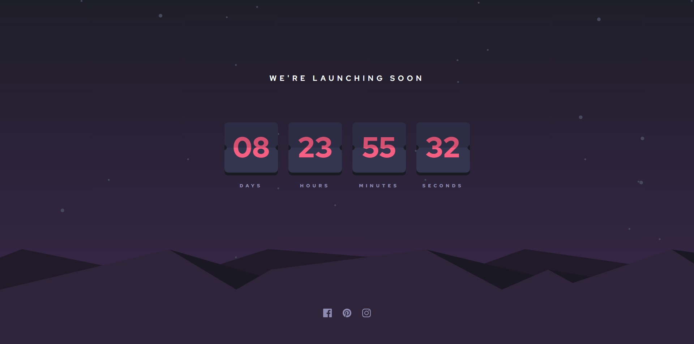

#  Frontend Mentor - Launch countdown timer solution

  

This is a solution to the [Launch countdown timer challenge on Frontend Mentor](https://www.frontendmentor.io/challenges/launch-countdown-timer-N0XkGfyz-). Frontend Mentor challenges help you improve your coding skills by building realistic projects.

  

##  Table of contents

  

-  [Overview](#overview)

-  [The challenge](#the-challenge)

-  [Screenshot](#screenshot)

-  [Links](#links)

-  [My process](#my-process)

-  [Built with](#built-with)

-  [What I learned](#what-i-learned)

-  [Continued development](#continued-development)

-  [Useful resources](#useful-resources)

-  [Author](#author)

  

  

##  Overview

  

###  The challenge

  

Users should be able to:

  

-  See hover states for all interactive elements on the page

-  See a live countdown timer that ticks down every second (start the count at 14 days)

-  **Bonus**: When a number changes, make the card flip from the middle

  

###  Screenshot

  

###  Links

  

-  Solution URL: [Add solution URL here](https://your-solution-url.com)

-  Live Site URL: [Add live site URL here](https://your-live-site-url.com)

  

##  My process

  

###  Built with

  

-  Semantic HTML5 markup

-  CSS custom properties

-  Flexbox

-  Mobile-first workflow

- Javascript  

  

###  What I learned

 
While working on this project, I learned about using intervals in JavaScript and creating 3D transitions with CSS.

###  Useful resources

  

-  [Nromalize css](https://necolas.github.io/normalize.css/) - To ensure more consistent styles across different browsers, I used Normalize.css in this project.  

##  Author

-  Frontend Mentor - [@Pex-Dev](https://www.frontendmentor.io/profile/Pex-Dev)